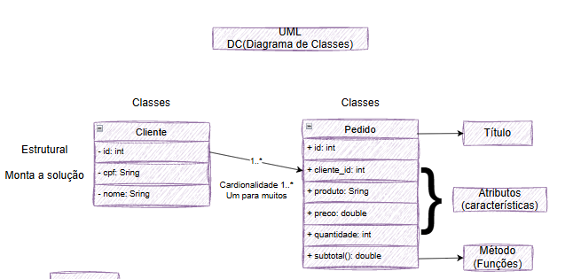

# Pedidos Backend MVC DC

Back-end com duas coleções mockup JSON clientes e pedidos, CRUD, para aprender, MVC e UML diagrama de classes

## Diagrama



## Tecnologias

- Node.js
- VsCode (Thunder Client)
- JavaScript
- MVC

## Passos para testar

- Clone este repositório e abra com VsCode
- Instale as dependências e execute com os seguintes comandos no terminal:

```bash
npm install
npm run dev
´´´

## Testes no Thunder Client

### Alterar cliente


### Alterar pedido


### Excluir cliente


### Excluir pedido

