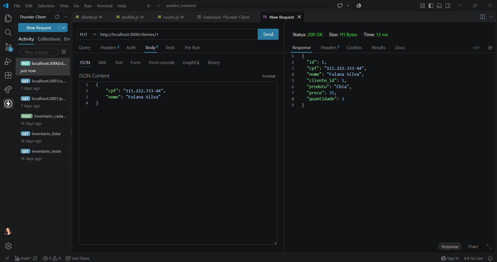
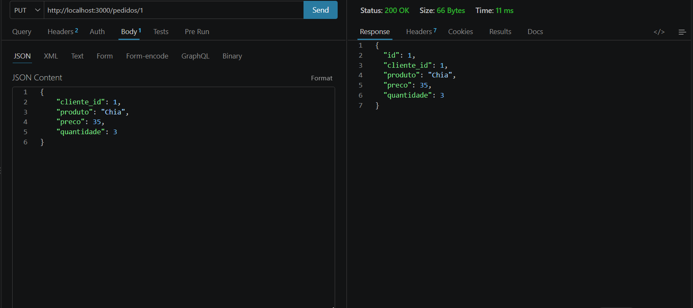
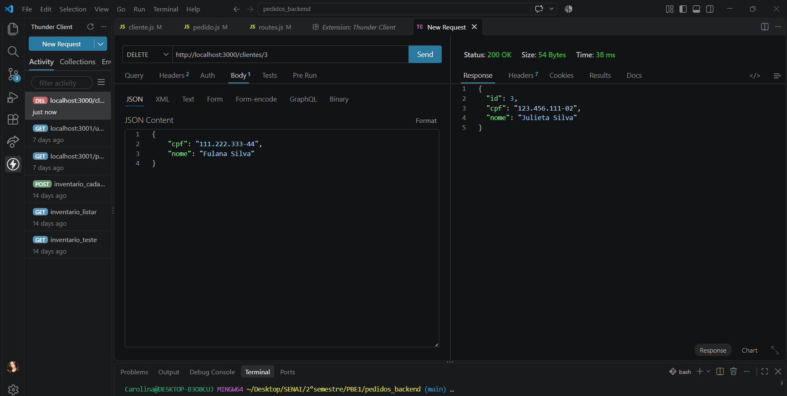
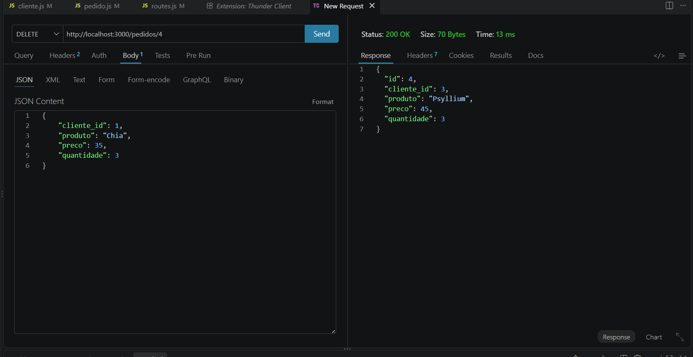

# Pedidos Backend MVC DC

Back-end com duas coleções mockup JSON clientes e pedidos, CRUD, para aprender, MVC e UML diagrama de classes

## Diagrama


## Tecnologias

- Node.js
- VsCode (Thunder Client)
- JavaScript
- MVC

## Passos para testar

- Clone este repositório e abra com VsCode
- Instale as dependências e execute com os seguintes comandos no terminal:

```bash
npm install
npm run dev
```

## Testes no Thunder Client

### Atividade 1 — Alterar e excluir clientes e pedidos

### Alterar cliente



### Alterar pedido



### Excluir cliente



### Excluir pedido


